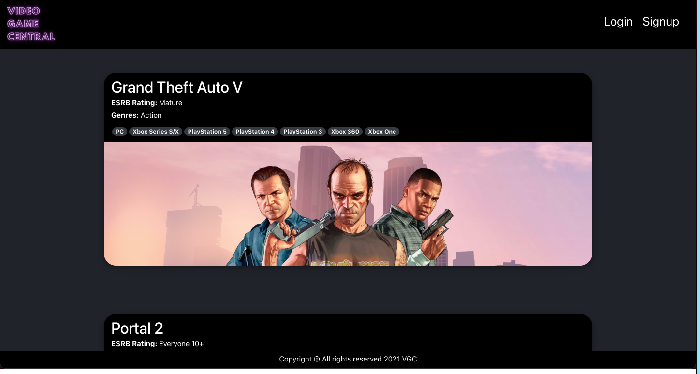
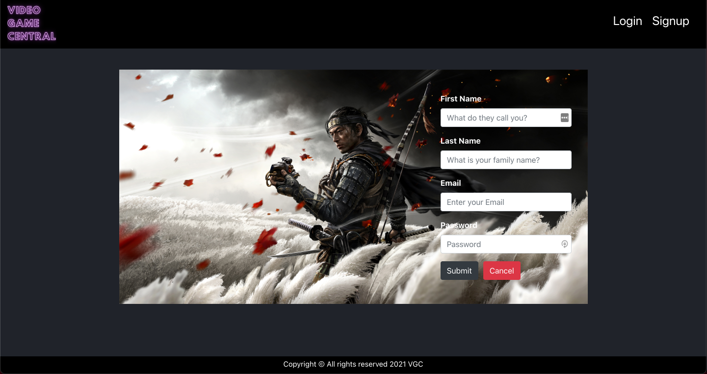
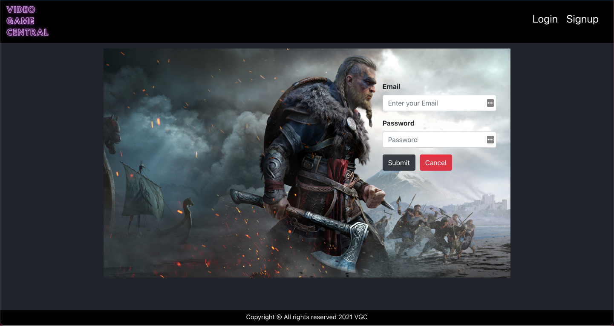

# VideoGameCentral

## Introduction

This app was created to help the user find information about their favorite video games.

## Screenshots

## Technologies Used

- MongoDB
- Express
- React
- Node.js
- JavaScript
- CSS
- Mongoose
- RAWG API
- Netlify
- Heroku

## Getting Started

- Trello Link - https://trello.com/b/L2czAB36/videogamecentral

- Deployed App Link - https://video-game-central.netlify.app/

## Future Enhancements

In the future, I want to add a search component to help filter through all the game titles. Also, I want allow the user to create a wish list of all the game titles their interested in play in the future.
